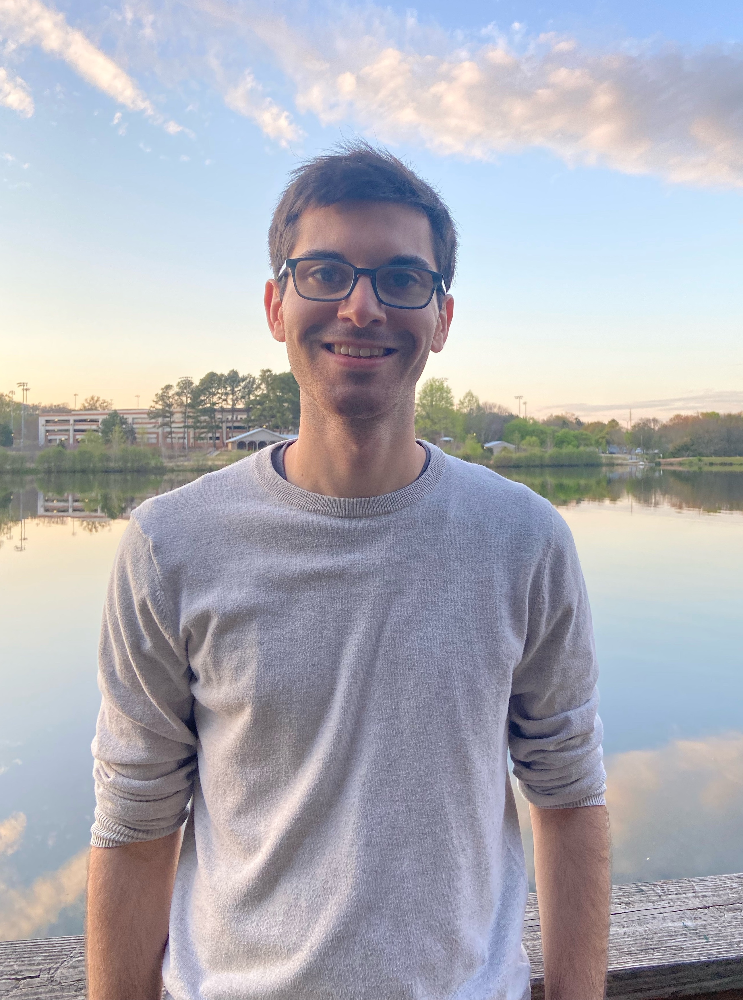

---

layout: page
title: Home
permalink: /home/
---

Welcome!  

I am a Research Assistant Professor in the MSCS department at the [University of Illinois Chicago](https://mscs.uic.edu/) working in number theory. My postdoctoral mentor is [Alina Cojocaru](https://www.alinacarmencojocaru.com/acc-main.html). 

I received my PhD in 2023 from the [University of Georgia](https://www.math.uga.edu/) in Athens, GA under the direction of [Pete L. Clark](http://alpha.math.uga.edu/~pete/). I completed my B.S. in math and physics at [Tufts University](https://math.tufts.edu/) in Medford, MA in 2017.  
  
<!--- comment 
### Upcoming Activities + Travel

* [AMS MRC on Explicit Computations with Stacks](https://www.ams.org/programs/research-communities/2023MRC-Stacks)   
	June 4--10, 2023  

* [Rethinking Number Theory 4](https://sites.google.com/view/rethinkingnumbertheory/projects)  
	June 12--23, 2023  

---> 

Contact:
* Email: fsaia (at) uic (dot) edu 
* Office: [SEO](https://maps.app.goo.gl/EBLQY8RyE1NujWKf7) 610

[CV](https://drive.google.com/open?id=1XRbHBVtFHX0CR19FEnn8QhG1OLDe2Qit&usp=drive_fs)
 
 
 
